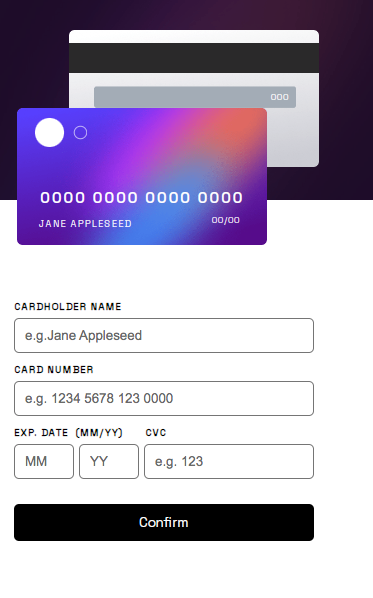

# Frontend Mentor - Interactive card details form solution

This is a solution to the [Interactive card details form challenge on Frontend Mentor](https://www.frontendmentor.io/challenges/interactive-card-details-form-XpS8cKZDWw). Frontend Mentor challenges help you improve your coding skills by building realistic projects. 

## Table of contents

- [Overview](#overview)
  - [The challenge](#the-challenge)
  - [Screenshot](#screenshot)
  - [Links](#links)
- [My process](#my-process)
  - [Built with](#built-with)
  - [What I learned](#what-i-learned)
  - [Continued development](#continued-development)
  - [Useful resources](#useful-resources)
- [Author](#author)
- [Acknowledgments](#acknowledgments)

**Note: Delete this note and update the table of contents based on what sections you keep.**

## Overview

### The challenge

Users should be able to:

- Fill in the form and see the card details update in real-time
- Receive error messages when the form is submitted if:
  - Any input field is empty
  - The card number, expiry date, or CVC fields are in the wrong format
- View the optimal layout depending on their device's screen size
- See hover, active, and focus states for interactive elements on the page

### Screenshot

### Links

- Solution URL: [Add solution URL here](https://github.com/arenascode/Interactive-card-details-form.git)
- Live Site URL: [Add live site URL here](https://your-live-site-url.com)

## My process

### Built with

- Semantic HTML5 markup
- CSS custom properties
- Flexbox
- Mobile-first workflow
- [Sass]

### What I learned

With this project I learned a lot and reforce form validation trough HTML, CSS and JS. I didn't know a RegExp, so this project was a good way to know that for validate numbers of credit card. I must continue practice and learn about regular expresions because is a very important thing to learn. 

To see how you can add code snippets, see below:

### Continued development

I'm going to continue focusin in regular expressions to give me a better understanding of this tools because this is not totally clear to me.

## Acknowledgments

I would not have been able to finish this project if it had not been for the solution of the other members of this community. I want to thanks to @nelsonleone, his solution helped me a lot. Thanks to him I knew the regular expression to should validate a credit card field

